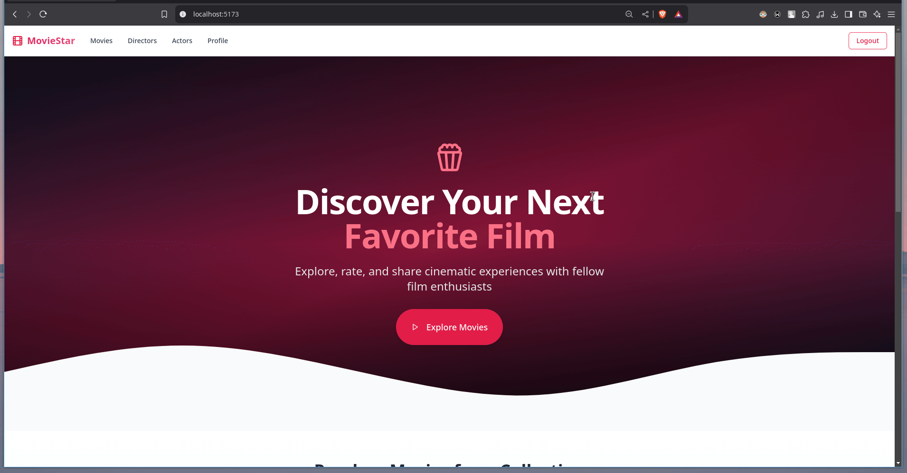
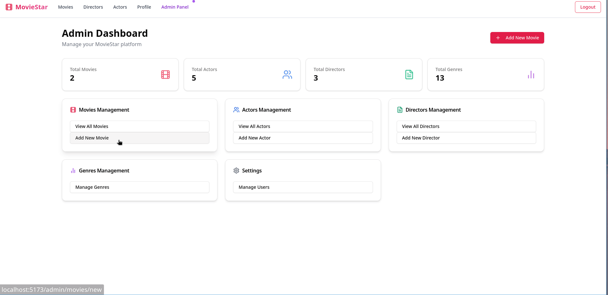
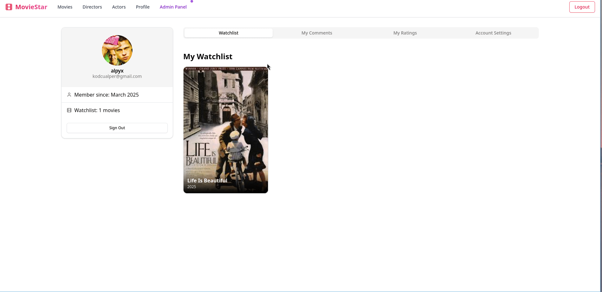
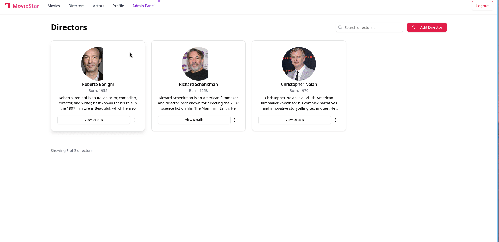

# MovieStar

Moviestar is an imdb clone movie rating application that is capable of more than just rating!


## Project Structure

This repository contains both the frontend and backend components of the MovieStar application:

- `frontend/`: React TypeScript application built with Vite
- `app/`: Spring Boot Java backend API

## Features

- Browse and search for movies, actors, and directors
- User authentication and profile management
- Comment system with likes/dislikes
- Movie rating system
- User watchlists
- Admin panel for content management

### Feature Showcase

<details>
<summary>Landing Page</summary>


</details>

<details>
<summary>Movie Details and Comments</summary>


</details>

<details>
<summary>Admin Dashboard</summary>


</details>

<details>
<summary>User Profiles</summary>


</details>

<details>
<summary>Directors and Actors</summary>


</details>

## Technology Stack

### Frontend
- React with TypeScript
- Vite build tool
- Authentication with Keycloak
- Axios for API communication
- Tailwind CSS for styling
- Cloudinary for image storage and management

### Backend
- Spring Boot Java application
- PostgreSQL database
- RESTful API architecture
- JWT authentication with Keycloak
- Comprehensive validation and error handling

## Getting Started

### Prerequisites
- Node.js and npm
- Java 17
- PostgreSQL database
- Docker (optional, for containerized deployment)

### Setup

#### Backend

See the [Backend Documentation](./app/README.md) for detailed setup instructions and API documentation.

Quick start:
```bash
cd app
./mvnw spring-boot:run
```

#### Frontend

1. Install dependencies:
```bash
cd frontend
npm install
```

2. Create a `.env` file in the frontend directory with:
```
VITE_API_URL=http://localhost:8081/api
VITE_KEYCLOAK_URL=http://localhost:8080
VITE_KEYCLOAK_REALM=moviestar
VITE_KEYCLOAK_CLIENT_ID=moviestar-frontend
VITE_CLOUDINARY_CLOUD_NAME=your_cloud_name
VITE_CLOUDINARY_UPLOAD_PRESET=your_upload_preset
VITE_CLOUDINARY_QUALITY=auto:best
VITE_CLOUDINARY_FETCH_FORMAT=auto

3. Start the development server:
```bash
npm run dev
```

4. Access the application at `http://localhost:5173`

## Docker Setup

The project includes Docker configuration:

```bash
docker-compose up -d
```

This will start:
- PostgreSQL database
- Keycloak authentication server
- Backend API (if configured)

## API Documentation

The backend provides a comprehensive REST API for all application features:

- Movies management
- Actors and directors
- User comments and ratings
- Watchlist functionality
- Administrative operations

For detailed API documentation, please refer to the [Backend API Documentation](./app/README.md).

## License

My application is free to use you can use it however you like! 


## Contributors

Contributors will be listed here.